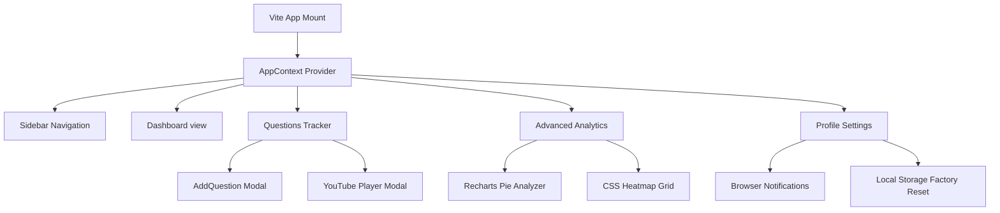

<h1 align="center">⚡ CODETRACK ⚡</h1>
<p align="center">
  <sub><b>The Cyberpunk LeetCode & DSA Content Creator Suite</b></sub>
</p>

<p align="center">
  
  
  
  
  
</p>

<p align="center">
  <a href="#-key-features">Key Features</a> •
  <a href="#-technical-specifications">Technical Specifications</a> •
  <a href="#%EF%B8%8F-user-workflows">User Workflows</a> •
  <a href="#-quick-start">Quick Start</a> •
  <a href="#-project-structure">Project Structure</a> •
  <a href="#-future-roadmap">Future Roadmap</a>
</p>

---

## 🌌 The Design Philosophy

**CodeTrack** is a premium developer tool styled with a custom **"Cyberpunk Neon"** dark theme. It combines utility with high-end frontend design, leveraging:

* 🪞 **Glassmorphic Elements**: Translucent containers reflecting ambient color gradients.
* ⚛️ **Framer Motion Animations**: Custom spring transitions on buttons and preference switches.
* 🎨 **Tailwind CSS v4 Tokens**: A dynamic variable mapping system driving light/dark mode shifts instantly.
* 🎉 **Victory Celebrations**: Dynamic, customizable confetti cannons on problem completions.

---

## 🚀 Key Features

| Feature | Details | Key Aesthetic |
| :--- | :--- | :--- |
| **Command Center (Dashboard)** | Real-time statistics, dynamic streak calculation, recent logs feed, and difficulty bars. | Neon blue details & custom glows |
| **Questions Hub (Tracker)** | Dual-column status tracking for both **Long Tutorials** and **Short Videos** with separate `EDITED` and `UPLOADED` tags. | Card grid layouts |
| **Video Player (Preview)** | Parse raw YouTube links (`Shorts` / `watch` / `youtu.be`) and preview videos inline inside a clean blur modal. | Overlay frames |
| **Analytics Engine** | GitHub-like contribution heatmap grid and interactive Recharts donut breakdown. | Active visual color density |
| **App Configuration** | Full backup system (JSON Export), Notification API prompt, and master clear factory defaults. | Toggles and sliders |

---

## 🛠️ Technical Specifications



- **Frontend Core**: React 19 (Hooks, Context Provider for central state)
- **Styles & Layout**: Tailwind CSS v4.0.0 (dynamic design system token overrides)
- **Compiler**: Vite 8.0.12 (instant hot module replacement)
- **Animations**: Framer Motion 12 & Canvas Confetti
- **Graphs & Charts**: Recharts 2.12 (highly interactive SVG layers)

---

## 📖 User Workflows

### 💻 Tracking a Question
1. Open the **Tracker** panel and click **+ Add Question**.
2. Input the LeetCode question index, title, difficulty (`Easy`/`Medium`/`Hard`), and topic.
3. Add any custom intuition write-ups and links to LeetCode.

### 🎬 Managing Video Deliverables
1. As you record, edit, and export your video tutorials, toggle the status on the tracker cards:
   - Click `NOT EDITED` $\rightarrow$ `EDITED` (active green).
   - Click `NOT UPLOADED` $\rightarrow$ `UPLOADED` (active pink).
2. If you added a YouTube URL, click the glowing red **▶ WATCH** button on the card to play and review your video in-app.

---

## 🏁 Quick Start

Setting up CodeTrack locally is extremely simple.

### Installation

1. **Clone the repository**
   ```bash
   git clone https://github.com/priyabratasahoo780/video_tracker.git
   ```

2. **Access directory & install dependencies**
   ```bash
   cd video_tracker
   npm install
   ```

3. **Launch local dev environment**
   ```bash
   npm run dev
   ```

Open your browser to `http://localhost:5173`.

---

## 📂 Project Structure

```
video_tracker/
├── public/                 # Static SVG icons and favicon assets
├── src/
│   ├── assets/             # Logos and banners
│   ├── components/
│   │   ├── AddQuestionModal.jsx # Question creation form modal
│   │   └── Sidebar.jsx     # Side navbar panel with responsive layout toggles
│   ├── context/
│   │   └── AppContext.jsx  # Context state, storage sync, and core CRUD logic
│   ├── pages/
│   │   ├── Dashboard.jsx   # Metrics, activity feed, and progress ratios
│   │   ├── Tracker.jsx     # Question grid, watch player, and search
│   │   ├── Analytics.jsx   # Heatmap contribution grid and charts
│   │   ├── Profile.jsx     # User details card with custom avatar forms
│   │   └── Settings.jsx    # Toggles, notifications, and master reset
│   ├── App.jsx             # Main router
│   ├── index.css           # Tailwind custom imports and root theme variables
│   └── main.jsx            # Application mount point
├── vite.config.js          # Vite config using @tailwindcss/vite
└── package.json            # Development dependencies
```

---

## 🔮 Future Roadmap

- [ ] **Database Integrations**: Sync local storage to Mongo or Firebase.
- [ ] **AI Summaries**: Scan problem links and automatically fill notes/intuition.
- [ ] **Reminders**: Send scheduled push notifications to stay active.
- [ ] **Google Sheets Sync**: Real-time sheets logging for team sheets coordination.

---

## 🤝 Contributing

Contributions are what make the open source community such an amazing place to learn, inspire, and create.
1. Fork the Project.
2. Create your Feature Branch (`git checkout -b feature/AmazingFeature`).
3. Commit your Changes (`git commit -m 'Add some AmazingFeature'`).
4. Push to the Branch (`git push origin feature/AmazingFeature`).
5. Open a Pull Request.

---

## 🛡️ License

Distributed under the MIT License. See `LICENSE` for more information.

---

<div align="center">
  <p>Engineered for high-performing developer creators. 🌟</p>
</div>
