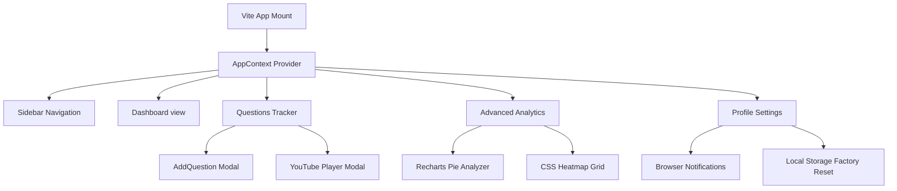

# <align align="center">⚡ CodeTrack — The Cyberpunk LeetCode & Creator Dashboard</align>

<div align="center">
  <p align="center">
    
    
    
    
    
  </p>
  
  <h4>A clinical, cyberpunk-themed tracking suite engineered for developers, educators, and content creators.</h4>

  <p>
    <a href="#-key-modules">Modules</a> • 
    <a href="#%EF%B8%8F-tech-specs">Tech Specs</a> • 
    <a href="#-quick-start">Quick Start</a> • 
    <a href="#-project-anatomy">Anatomy</a>
  </p>
</div>

---

## 🌌 The Aesthetic Philosophy
**CodeTrack** moves away from generic, plain spreadsheets. Inspired by modern SaaS dashboard interfaces and neon retro-futurism, the application leverages:
* 🪟 **Glassmorphism panels** reflecting ambient color backdrops.
* ⚡ **Physics-based micro-interactions** handled by Framer Motion.
* 🎨 **Variables-mapped design system** supporting instant dark-to-light translation.
* 🍿 **Reward-oriented gamification** with dynamic confetti cannons on problem completion.

---

## 🚀 Key Modules

### 1. 📊 Creator Command Center (Dashboard)
The dashboard operates as the central hub of your coding and media workflows:
* **Real-time Analytics**: Solve counts, long videos, and short videos tracking cards.
* **Algorithmic Streak Meter**: Dynamic calculations tracking consecutive days of problem-solving.
* **DSA Difficulty Breakdowns**: Glowing color-coded bars indicating Easy, Medium, and Hard task percentages.
* **Activity Log**: Chronologically lists recent question logs.

### 2. 📝 Questions & Media Hub (Tracker)
A grid-based tracking matrix that merges coding achievements with your media pipeline:
* **Workflow Splits**: Track content editing and uploads separately for **Long Tutorials** and **Short Videos**.
* **Embedded Video Player**: Integrated YouTube frame parser lets you watch uploaded content in a responsive overlay modal.
* **Topic Badging**: Custom categorization badges mapping out problem sectors.
* **Keyword Search & Filters**: Instant matching based on index values, titles, difficulty rating, or status.

### 3. 📉 Advanced Analytics Engine
* **Contribution Heatmap**: A 140-day contribution graph that brightens with electric blue hues as your daily productivity climbs.
* **Distribution Analyzer**: Recharts-driven interactive donut visualization showing your DSA topic layout with custom tooltip card overlays.

### 4. ⚙️ Preferences & Factory Control
* **Flexible Light/Dark Theme**: Flips CSS custom color variables dynamically to preserve style layout.
* **Browser Alert Integrations**: Integrates with standard browser APIs to request desktop push notifications.
* **Confetti Toggles**: Turn rewards on/off.
* **Data Backups**: Fast JSON imports and exports, plus confirmation master clear triggers.

---

## 🛠️ Tech Specs



* **Frontend Engine**: React 19.2.6 (context-based state management).
* **Speed Framework**: Vite 8.0.12 (HMR compiler).
* **Styles & Theme**: Tailwind CSS v4.0.0 (dynamic theme tokenization).
* **Charting System**: Recharts 2.12+ (customized glowing SVG components).

---

## 🏁 Quick Start

Setting up CodeTrack locally is extremely simple.

### Installation

1. **Clone the repository**
   ```bash
   git clone https://github.com/priyabratasahoo780/video_tracker.git
   ```

2. **Access directory & install dependencies**
   ```bash
   cd video_tracker
   npm install
   ```

3. **Launch local dev environment**
   ```bash
   npm run dev
   ```

The local development server will spin up instantly. Open your browser to `http://localhost:5173`.

---

## 📂 Project Anatomy

```
video_tracker/
├── public/                 # Static SVG icons and favicons
├── src/
│   ├── assets/             # Branding graphics
│   ├── components/
│   │   ├── AddQuestionModal.jsx # Dynamic form overlay
│   │   └── Sidebar.jsx     # Side navbar panel with responsive controls
│   ├── context/
│   │   └── AppContext.jsx  # Global storage hub, settings, & CRUD handlers
│   ├── pages/
│   │   ├── Dashboard.jsx   # Streak tracker, feed, and difficulty ratios
│   │   ├── Tracker.jsx     # Card matrix, media filters, and YouTube iframe
│   │   ├── Analytics.jsx   # Heatmap contribution grid and charts
│   │   ├── Profile.jsx     # User details card with custom avatar forms
│   │   └── Settings.jsx    # Sound toggles, notifications, and reset
│   ├── App.jsx             # Route layout setup
│   ├── index.css           # Tailwind custom imports and root theme variables
│   └── main.jsx            # Application mount point
├── vite.config.js          # Vite config using @tailwindcss/vite
└── package.json            # Development dependencies
```

---

<div align="center">
  <p>Engineered for high-performing developer creators. 🌟</p>
</div>
